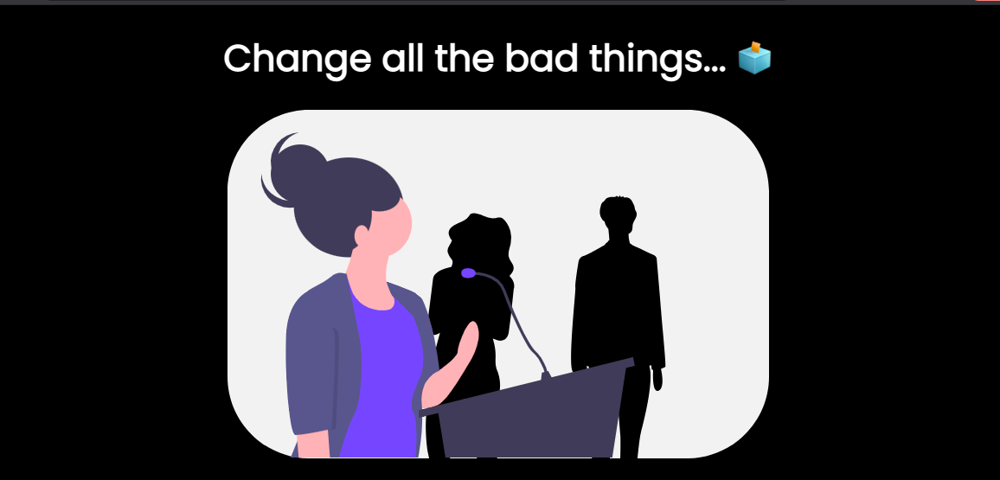
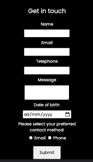
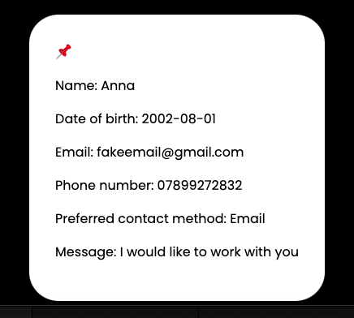

# Change all the bad things 🗳️

This project is a contact form for a fictional social justice group.

The user inputs from the contact form are displayed on a card below on submit.

Site header:

Contact form:

User details:

I wrote a series of functions to check and validate the form inputs.

If I had more time on this project I would like to add a database component. I would also like to add authorisation/authentification 🔑
